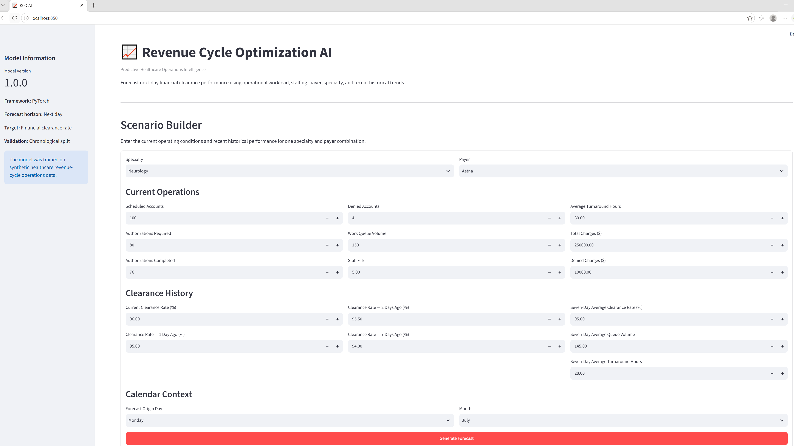
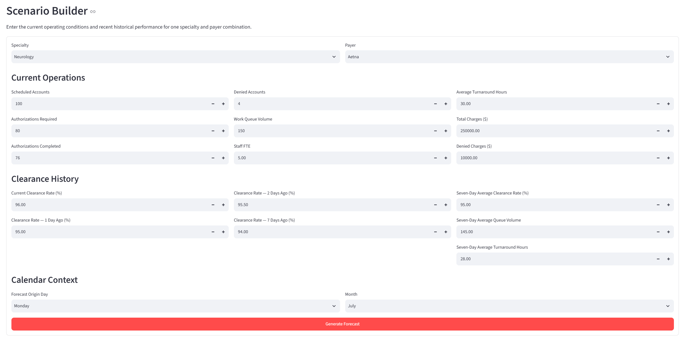
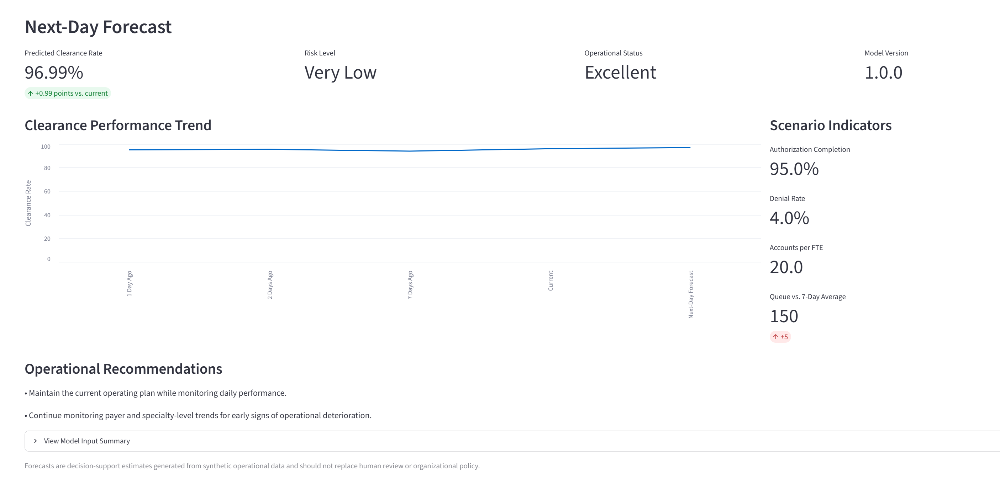
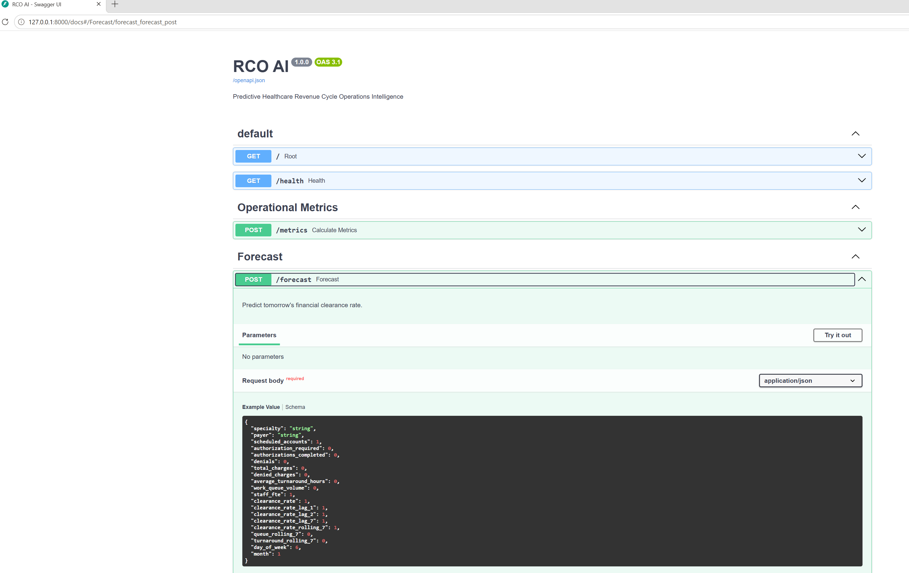
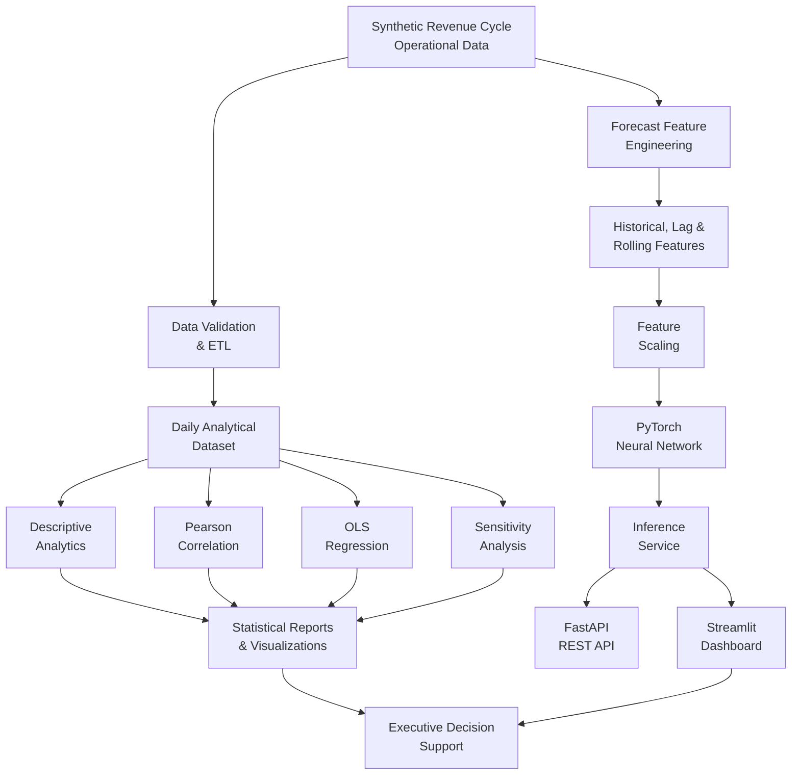
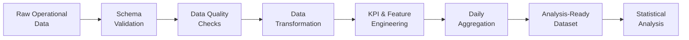
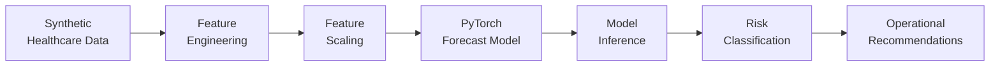

# 📈 RCO AI

### Healthcare Revenue Cycle Analytics & Predictive Intelligence


**An end-to-end healthcare revenue cycle analytics and machine learning platform combining data engineering, statistical analysis, predictive forecasting, API development, and interactive decision support.**

RCO AI uses synthetic healthcare operational data to demonstrate how revenue cycle organizations can move beyond retrospective reporting to analyze operational performance, quantify relationships between workflow and financial outcomes, forecast future clearance performance, and support proactive decision-making.

The current version contains two complementary analytical systems:

- **Statistical Analytics** — ETL, data validation, operational KPI engineering, descriptive statistics, hypothesis testing, Pearson correlation, Ordinary Least Squares (OLS) regression, sensitivity analysis, statistical reporting, and executive visualizations.
- **Predictive Machine Learning** — PyTorch-based next-day financial clearance forecasting using operational, staffing, payer, specialty, calendar, and historical workflow features.

The platform also exposes predictive functionality through a **FastAPI REST API** and provides business-facing forecasting and operational intelligence through an interactive **Streamlit dashboard**.

---

# Dashboard Preview

The application provides an interactive executive dashboard for forecasting next-day financial clearance performance, visualizing operational KPIs, evaluating risk, and generating operational recommendations.

| Executive Dashboard | Scenario Builder |
|---|---|
|  |  |
| **Forecast Results** | **FastAPI Swagger UI** |
|  |  |

---

# Business Problem

Revenue cycle leaders constantly answer questions such as:

- Will tomorrow's financial clearance rate decline?
- Are staffing levels sufficient for current workload?
- Is authorization workload becoming a bottleneck?
- Are work queues growing faster than the team can manage?
- Are longer authorization turnaround times associated with greater financial risk?
- Which operational indicators should leadership monitor today?
- Can historical and current workflow data identify risk before performance declines?

Traditional operational reporting often focuses on **what already happened**.

RCO AI demonstrates a broader analytical approach:

> **Understand what happened → evaluate what is related to it → quantify those relationships → predict what may happen next → support operational action.**

---

# Solution

RCO AI combines multiple layers of the modern analytics lifecycle:

### Data Engineering

- Synthetic healthcare revenue cycle data generation
- Schema and data-quality validation
- Reproducible ETL pipelines
- Data cleaning and transformation
- Daily operational aggregation
- Weighted authorization turnaround calculations
- Operational KPI engineering
- Analysis-ready dataset generation

### Statistical Analytics

- Descriptive statistics
- Pearson correlation analysis
- Statistical hypothesis testing
- Ordinary Least Squares regression
- Confidence intervals and significance testing
- Regression diagnostics
- Sensitivity analysis
- Correlation analysis
- Automated statistical reporting
- Executive analytical visualizations

### Predictive Machine Learning

- PyTorch neural-network forecasting
- Time-series and historical feature engineering
- Lag and rolling-window features
- Categorical encoding
- Feature scaling
- Chronological train / validation / test splitting
- Baseline comparison
- Early stopping
- Model evaluation
- Persisted model artifacts
- Reusable inference pipeline

### Application & Decision Support

- FastAPI REST API
- Pydantic request validation
- Streamlit executive dashboard
- Executive KPI visualization
- Operational risk classification
- Scenario analysis
- Forecasting
- Operational recommendations

---

# Platform Architecture



RCO AI uses a shared synthetic revenue cycle operational data foundation to support two complementary analytical workflows.

The **statistical analytics path** validates and transforms operational data into a daily analytical dataset used for descriptive analytics, Pearson correlation, OLS regression, sensitivity analysis, statistical reporting, and visualization.

The **predictive machine learning path** separately engineers forecasting features, including historical, lag, rolling-window, operational, payer, specialty, and calendar features. These features are scaled and passed to a PyTorch neural network that forecasts next-day financial clearance performance. The trained model is accessed through a reusable inference service that supports both the FastAPI REST API and Streamlit dashboard.

Together, these workflows combine **data engineering, statistical analysis, predictive machine learning, and application development** to support revenue cycle operational decision-making.

---

# Synthetic Revenue Cycle Dataset

Because real healthcare revenue cycle data can contain protected health information and confidential organizational information, RCO AI uses a synthetic dataset designed to model realistic financial clearance operations.

The capstone analytical dataset begins with:

- **108,000 operational records**
- **6 clinical specialties**
- **6 insurance payers**

Operational variables include:

- Scheduled accounts
- Cleared accounts
- Authorization-required volume
- Completed authorizations
- Denials
- Total charges
- Denied charges
- Authorization turnaround time
- Work queue volume
- Staff FTE

For the statistical analysis, the ETL pipeline aggregates the detailed operational records into **3,000 daily observations**.

This approach allows the complete data engineering, analytics, and machine learning lifecycle to be demonstrated without exposing PHI or proprietary healthcare data.

---

# Data Engineering & ETL Pipeline

The post-capstone version of RCO AI includes a dedicated analytical ETL pipeline.



## Data Validation

Before analysis, the pipeline checks data quality and business-rule consistency.

Validation includes:

- Required columns
- Missing values
- Duplicate records
- Invalid dates
- Numeric data types
- Negative numeric values
- Operational business rules

Examples of operational consistency rules include:

```text
cleared_accounts <= scheduled_accounts

authorizations_completed <= authorization_required

denials <= scheduled_accounts
```

The analytical workflow documented successful processing of all **108,000 synthetic records** without missing values, duplicate records, invalid dates, or negative values in fields expected to be nonnegative.

---

# Operational Feature Engineering

Raw operational measures are transformed into normalized revenue cycle KPIs.

### Clearance Rate

```text
cleared_accounts / scheduled_accounts
```

Measures the proportion of scheduled accounts successfully financially cleared.

### Authorization Completion Rate

```text
authorizations_completed / authorization_required
```

Measures completion of authorization-required workload.

### Denial Rate

```text
denials / scheduled_accounts
```

Normalizes denial volume against scheduled activity.

### Denied Charge Rate

```text
denied_charges / total_charges
```

Measures denied charges relative to total charge volume.

### Workload per FTE

```text
work_queue_volume / staff_fte
```

Relates operational backlog to available staffing capacity.

---

# Weighted Authorization Turnaround Time

Authorization turnaround time is aggregated using authorization-required volume as a weight.

```text
weighted turnaround contribution =
average turnaround hours × authorization-required volume
```

The daily weighted value is then calculated as:

```text
sum(weighted turnaround contributions)
/
sum(authorization-required volume)
```

This prevents a low-volume operational group from having the same influence on the daily turnaround metric as a group processing substantially more authorization activity.

---

# Statistical Analytics

The capstone expansion introduced a formal statistical analysis examining the relationship between **authorization turnaround time** and **denied charges**.

## Research Question

> To what extent does authorization turnaround time affect denied charges in healthcare revenue cycle operations?

## Hypotheses

**Null hypothesis (H₀):**

There is no statistically significant relationship between authorization turnaround time and denied charges.

**Alternative hypothesis (H₁):**

There is a statistically significant positive relationship between authorization turnaround time and denied charges.

The analysis uses:

- Descriptive statistics
- Pearson correlation
- Ordinary Least Squares regression
- Statistical significance testing
- Confidence intervals
- Regression diagnostics
- Sensitivity analysis

---

# Statistical Findings

Within the synthetic dataset, authorization turnaround time demonstrated a strong positive association with denied charges.

## Primary Analysis

| Metric | Result |
|---|---:|
| Observations | 3,000 |
| Pearson correlation | **0.861** |
| Statistical significance | **p < 0.001** |
| Regression coefficient | **~$12,494.83 per hour** |
| R² | **0.742** |

Within the simulated dataset, each additional hour of average authorization turnaround time was associated with approximately **$12,495 in additional predicted daily denied charges**.

The fitted regression explained approximately **74.2% of the observed variation in daily denied charges**.

> **Important:** These findings describe statistical association within a synthetic dataset. They should not be interpreted as proof of causation or as an estimate of financial impact for a real healthcare organization.

---

# Sensitivity Analysis

Absolute denied charges can also be influenced by total charge volume. To evaluate whether the primary result was driven only by differences in charge volume, the analysis was repeated using **denied-charge rate** rather than total denied charges.

| Metric | Result |
|---|---:|
| Pearson correlation | **0.772** |
| Statistical significance | **p < 0.001** |
| R² | **0.596** |

The relationship remained positive and statistically significant after normalizing denied charges against total charge volume, providing an additional robustness check for the primary finding within the synthetic environment.

---

# Statistical Outputs

The analytical pipeline produces outputs including:

- Descriptive statistical summaries
- Authorization turnaround distributions
- Denied-charge distributions
- Turnaround vs. denied-charge regression visualization
- Fitted regression line
- Regression residual diagnostics
- Correlation analysis
- Statistical summary tables
- Executive analytical visualizations
- Validation and reporting artifacts

---

# Predictive Machine Learning

The predictive component forecasts **next-day financial clearance rate** using a PyTorch feed-forward neural network.

## Neural Network Architecture

```text
32 Input Features
        ↓
Linear: 32 → 64
        ↓
ReLU
        ↓
Linear: 64 → 32
        ↓
ReLU
        ↓
Linear: 32 → 16
        ↓
ReLU
        ↓
Linear: 16 → 1
        ↓
Next-Day Clearance Forecast
```

The model uses operational, historical, staffing, payer, specialty, and calendar features to estimate future financial clearance performance.

---

# Key Model Inputs

The forecasting model incorporates **32 engineered features** across several categories.

### Operational Features

- Scheduled accounts
- Authorization-required volume
- Authorizations completed
- Denials
- Total charges
- Denied charges
- Average authorization turnaround time
- Work queue volume
- Staff FTE

### Engineered KPIs

- Clearance rate
- Authorization completion rate
- Denial rate
- Accounts per FTE
- Revenue per account

### Historical Features

- Previous-day clearance rate
- Two-day lag
- Seven-day lag
- Seven-day rolling clearance rate
- Seven-day rolling work queue
- Seven-day rolling turnaround time

### Categorical Features

- Clinical specialty
- Insurance payer

### Calendar Features

- Day of week
- Month

---

# Time-Aware Model Validation

Because RCO AI forecasts future operational performance, the model uses **chronological rather than random dataset splitting**.

| Dataset | Rows |
|---|---:|
| Training | 73,226 |
| Validation | 12,922 |
| Test | 21,564 |

Training observations occur first in time, followed by validation data and then the newest held-out test period.

This design helps prevent **temporal data leakage** and more closely represents a real forecasting environment in which a model learns from historical data and predicts future performance.

---

# Model Training

The forecasting pipeline includes:

- PyTorch tensors and DataLoaders
- Feature scaling
- Mean Squared Error loss
- Adam optimization
- Validation monitoring
- Early stopping
- Best-model checkpointing
- Baseline evaluation
- Final model evaluation

Current model metadata includes:

```text
Model: RCO AI Clearance Forecast Model
Model Version: 1.0.0
Target: Next-Day Clearance Rate
Features: 32
Best Epoch: 15
```

Model artifacts include:

```text
forecast_model.pt
feature_scaler.pkl
feature_schema.json
model_metadata.json
```

Persisting the model, scaler, feature schema, and metadata helps ensure that inference uses the same feature structure and preprocessing logic used during model development.

---

# Machine Learning Pipeline

The forecasting workflow transforms synthetic healthcare operational data into a next-day financial clearance prediction and corresponding operational decision support.



The pipeline separates feature preparation, preprocessing, model inference, and business-facing interpretation so that the trained forecasting model can be reused across the API and dashboard layers.

---

# Forecasting Application

Users can enter current operational conditions through the Streamlit dashboard.

The application:

1. Validates inputs.
2. Constructs the required model features.
3. Applies preprocessing and scaling.
4. Loads the trained PyTorch model.
5. Generates a next-day clearance forecast.
6. Converts the prediction into operational risk context.
7. Presents KPIs and recommended actions.

---

# API Example

## Request

```json
{
  "specialty": "Neurology",
  "payer": "Aetna",
  "scheduled_accounts": 100,
  "authorization_required": 80,
  "authorizations_completed": 76,
  "denials": 4,
  "total_charges": 250000,
  "denied_charges": 10000
}
```

## Response

```json
{
  "predicted_percentage": 96.99,
  "risk_level": "Very Low",
  "forecast": "Excellent",
  "model_version": "1.0.0"
}
```

FastAPI also provides interactive Swagger documentation for exploring and testing API endpoints.

---

# Technology Stack & Frameworks

| Layer | Technology |
|---|---|
| Language | Python 3.12 |
| Data Processing | Pandas, NumPy |
| Statistical Analysis | SciPy, Statsmodels |
| Machine Learning | PyTorch, scikit-learn |
| API | FastAPI |
| Data / API Validation | Pydantic |
| Dashboard | Streamlit |
| Visualization | Matplotlib, Streamlit |
| Model Persistence | PyTorch, Pickle, JSON |
| Testing | Pytest |
| API Server | Uvicorn |
| Containerization | Docker |
| Version Control | Git / GitHub |

---

# Project Structure

```text
RCO-AI/
│
├── assets/                  # Dashboard and API screenshots
│
├── data/
│   ├── raw/                 # Synthetic operational dataset
│   └── processed/           # Processed / analysis-ready datasets
│
├── models/                  # Trained model and ML artifacts
│
├── notebooks/               # Experimentation notebooks
│
├── reports/                 # Statistical reports, figures, tables,
│                            # validation outputs, and analytical artifacts
│
├── scripts/                 # Data, analytics, training, evaluation,
│                            # capstone analysis, and inference utilities
│
├── src/
│   ├── analytics/           # Statistical and operational analytics
│   ├── api/                 # FastAPI endpoints
│   ├── config/              # Application configuration
│   ├── data/                # Data generation, ETL, and reporting
│   ├── ml/                  # Feature engineering, training, and inference
│   ├── models/              # Pydantic request/response models
│   ├── services/            # Business logic and operational services
│   └── main.py              # FastAPI application
│
├── tests/                   # Automated tests
├── dashboard.py             # Streamlit dashboard
├── requirements.txt
├── Dockerfile
└── README.md
```

---

# Running Locally

Clone the repository:

```bash
git clone https://github.com/AnthonySotoData/RCO-AI.git
cd RCO-AI
```

Create a virtual environment:

```bash
python -m venv .venv
```

Activate the environment on Windows:

```bash
.venv\Scripts\activate
```

Install dependencies:

```bash
pip install -r requirements.txt
```

Run the API:

```bash
uvicorn src.main:app --reload
```

Open the interactive API documentation:

```text
http://127.0.0.1:8000/docs
```

Run the dashboard:

```bash
streamlit run dashboard.py
```

---

# Project Evolution

RCO AI began as a predictive financial clearance forecasting application.

The project was later expanded during graduate capstone work into a broader **healthcare revenue cycle analytics and predictive intelligence platform**.

The expansion added:

- Reproducible analytical ETL
- Data-quality validation
- Daily operational aggregation
- Revenue cycle KPI engineering
- Descriptive analytics
- Statistical hypothesis testing
- Pearson correlation analysis
- OLS regression
- Confidence intervals
- Regression diagnostics
- Sensitivity analysis
- Automated statistical reporting
- Executive analytical visualizations

The current project demonstrates an end-to-end technical lifecycle:

> **Data Engineering → Statistical Analysis → Machine Learning → API & Application Development → Operational Decision Support**

---

# Future Enhancements

- SHAP model explainability
- Multivariable statistical modeling
- Multi-day forecasting
- Forecast uncertainty intervals
- Automated anomaly detection
- Staffing optimization
- Model drift monitoring
- Automated retraining pipelines
- Expanded model registry and MLOps
- LLM-generated executive summaries
- Interactive forecasting trends
- Governed enterprise data integration

---

# Limitations

RCO AI is a portfolio and research demonstration built with synthetic operational data.

Important limitations include:

- Statistical findings are based on simulated rather than production healthcare data.
- Correlation and regression identify associations and do not establish causation.
- Synthetic relationships may not reproduce the behavior of a real healthcare organization.
- The primary statistical model does not control for every potential confounding factor.
- Forecast performance would require external validation before operational use.
- The platform is not intended for clinical decision-making.

Future research could evaluate the same analytical architecture using appropriately governed and de-identified operational data.

---

# Disclaimer

This project was developed as an original portfolio project and expanded through graduate analytics work using **synthetic healthcare operational data**.

It contains no protected health information and is not intended for clinical or production healthcare use.

---

# License

This project is licensed under the MIT License. See the [LICENSE](LICENSE) file for details.

---

# About the Author

Hi, I'm **Anthony Soto**, a healthcare operations and revenue cycle leader with experience applying **data analytics, data engineering, machine learning, AI, and automation** to operational business problems.

I developed **RCO AI** to combine healthcare revenue cycle domain knowledge with modern technical methods across the analytics lifecycle — from synthetic data generation and ETL through statistical analysis, predictive modeling, API development, and business-facing decision support.

My portfolio focuses on building practical technical solutions that connect analytics and AI with real-world operational challenges.

### Connect with Me

- **GitHub:** https://github.com/AnthonySotoData
- **LinkedIn:** https://www.linkedin.com/in/anthony-soto-a7b68716b