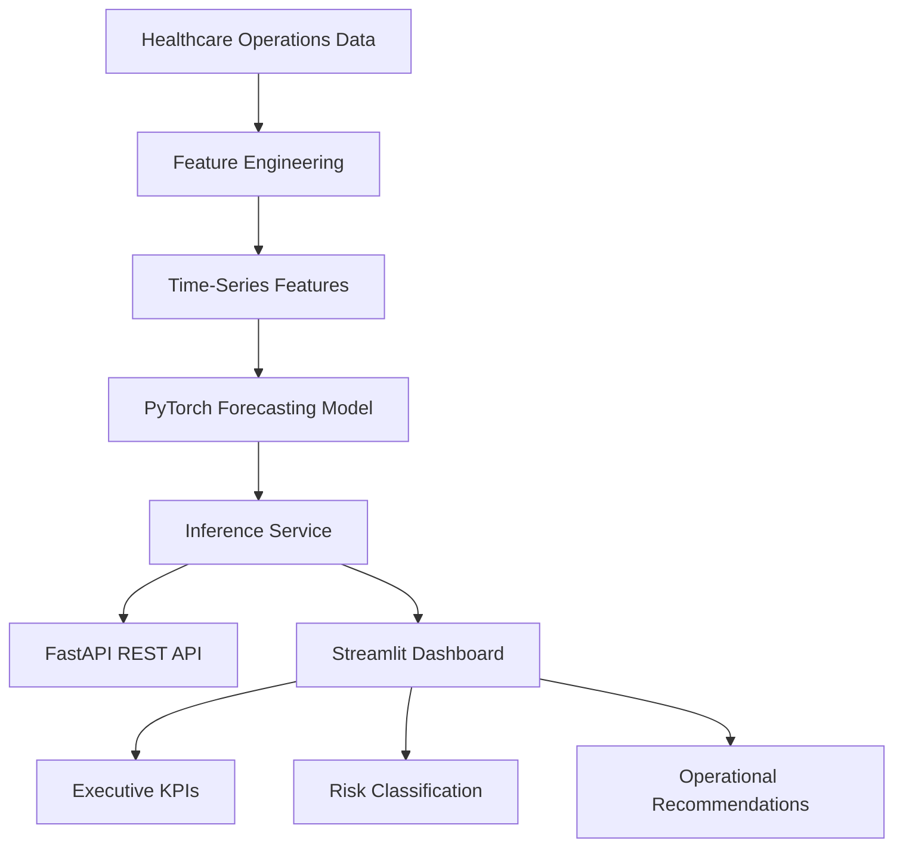
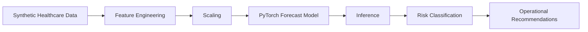

# 📈 RCO AI

### Predictive Healthcare Operations Intelligence


**An AI-powered decision support platform that forecasts next-day financial clearance performance using machine learning.**

RCO AI predicts next-day financial clearance performance using operational, staffing, payer, and historical workflow data. It demonstrates how machine learning can support proactive healthcare revenue cycle operations by identifying operational risk before it impacts patients, scheduling, or reimbursement.

The application includes:

- A FastAPI REST API for programmatic inference
- A Streamlit executive dashboard for interactive forecasting
- A PyTorch forecasting model trained on synthetic healthcare operational data

---

# Dashboard Preview

The application provides an interactive executive dashboard for forecasting next-day financial clearance performance, visualizing operational KPIs, and generating AI-driven recommendations.

| Executive Dashboard | Scenario Builder |
|----------------------|------------------|
|  |  |
| **Forecast Results** | **FastAPI Swagger UI** |
|  |  |

---

# Business Problem

Revenue Cycle leaders constantly answer questions like:

- Will tomorrow's clearance rate decline?
- Are staffing levels sufficient?
- Is the authorization workload becoming a bottleneck?
- Are work queues growing faster than the team can manage?
- Which operational indicators should leadership monitor today?

Most organizations react after performance declines.

RCO AI demonstrates a predictive approach that forecasts tomorrow's clearance performance using current operational metrics.

---

# Solution

The application combines:

- PyTorch neural network forecasting
- Time-series feature engineering
- FastAPI prediction API
- Streamlit executive dashboard
- Automated operational recommendations

Users provide current operational metrics and immediately receive:

- Predicted next-day financial clearance rate
- Operational risk classification
- Executive performance KPIs
- AI-driven operational recommendations

---

# How It Works

1. Operational metrics are entered through the Streamlit dashboard.
2. Inputs are validated using Pydantic models.
3. Feature engineering creates historical and operational indicators.
4. The trained PyTorch model predicts tomorrow's financial clearance rate.
5. Predictions are translated into operational risk levels.
6. Executive dashboards display KPIs, trends, and recommended actions.

---

# Features

- PyTorch forecasting model
- Time-series feature engineering
- Lag and rolling-window features
- Chronological train/test validation
- FastAPI REST API
- Streamlit dashboard
- Executive KPI cards
- Trend visualization
- Operational recommendations
- Model versioning
- Pydantic validation

---

# Technology Stack & Frameworks

| Layer | Technology |
|-------|------------|
| Language | Python |
| Machine Learning | PyTorch |
| API | FastAPI |
| Dashboard | Streamlit |
| Data Processing | Pandas, NumPy |
| Validation | Pydantic |
| Visualization | Streamlit Charts |
| Model Persistence | Torch |
| Testing | Pytest |

---

# Project Architecture



---

# Key Model Inputs

The forecasting model incorporates operational and historical features including:

- Scheduled accounts
- Authorization workload
- Authorization completion rate
- Denial rate
- Total charges
- Denied charges
- Work queue volume
- Staff FTE
- Average turnaround time
- Historical clearance rates
- Rolling operational averages
- Clinical specialty
- Insurance payer
- Calendar features

---

# API Example

### Request

```json
{
  "specialty": "Neurology",
  "payer": "Aetna",
  "scheduled_accounts": 100,
  "authorization_required": 80,
  "authorizations_completed": 76,
  "denials": 4,
  "total_charges": 250000,
  "denied_charges": 10000
}
```

### Response

```json
{
  "predicted_percentage": 96.99,
  "risk_level": "Very Low",
  "forecast": "Excellent",
  "model_version": "1.0.0"
}
```

---

# Project Structure

```text
RCO-AI/
│
├── assets/                 # Dashboard and API screenshots
├── data/
│   ├── raw/                # Synthetic operational dataset
│   └── processed/          # Processed datasets
├── models/                 # Trained model and ML artifacts
├── notebooks/              # Experimentation notebooks
├── scripts/                # Training and evaluation utilities
├── src/
│   ├── analytics/          # Operational analytics engine
│   ├── api/                # FastAPI endpoints
│   ├── config/             # Application configuration
│   ├── data/               # Data generation
│   ├── ml/                 # Feature engineering, training, inference
│   ├── models/             # Pydantic request/response models
│   ├── services/           # Business logic
│   └── main.py             # FastAPI application
├── tests/                  # Unit tests
├── dashboard.py            # Streamlit dashboard
├── requirements.txt
├── Dockerfile
└── README.md
```

# Running Locally

Clone the repository:

```bash
git clone <repository-url>
cd RCO-AI
```

Create a virtual environment:

```bash
python -m venv .venv
```

Activate:

Windows

```bash
.venv\Scripts\activate
```

Install dependencies:

```bash
pip install -r requirements.txt
```

Run the API:

```bash
uvicorn src.main:app --reload
```

Open the interactive API documentation:

```
http://127.0.0.1:8000/docs
```

Run the dashboard:

```bash
streamlit run dashboard.py
```

---

# Machine Learning Pipeline



---

# Future Enhancements

- SHAP explainability
- Multi-day forecasting
- Real-time Epic integration
- Staffing optimization
- Automated anomaly detection
- LLM-generated executive summaries
- Interactive forecasting trends

---

# Disclaimer

This project was developed as a portfolio demonstration using synthetic healthcare operational data.

It is not intended for clinical or production use.

---

# License

This project is licensed under the MIT License. See the [LICENSE](LICENSE) file for details.